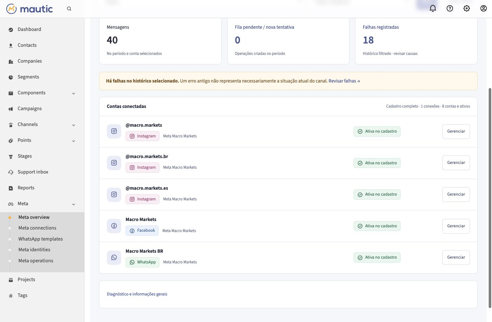
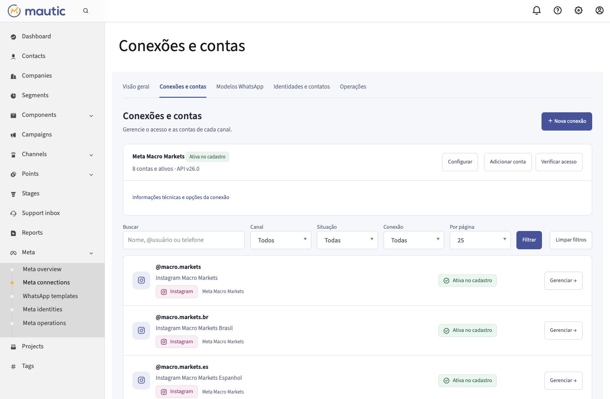
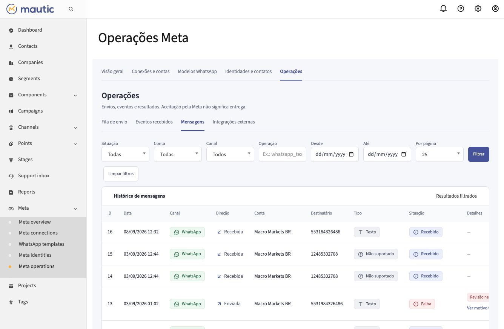

# Interface de administração Meta

As páginas do conector usam a navegação interna do Mautic e compartilham cores, espaçamento e controles. O Atendimento continua em seu próprio plugin; estas telas gerenciam conexões, contas, modelos, identidades e operações.

## Listas e filtros

- **Visão geral:** conta e período de criação (todo o histórico, 7 ou 30 dias). Mensagens, fila e falhas respeitam esses filtros; cadastro de contas e diagnóstico geral são explicitamente globais. Os indicadores abrem as operações filtradas.
- **Conexões e contas:** busca por conta, usuário, telefone ou conexão; tipo de conta, situação e conexão. A lista de ativos é paginada; conexões aparecem como resumos separados.
- **Modelos WhatsApp:** nome, conta, situação, idioma e categoria. Rejeição e qualidade são exibidas apenas quando informadas pela Meta.
- **Identidades:** nome, e-mail, telefone, ID ou conta; canal incluindo Facebook, conta, consentimento e existência de vínculo. Sincronização, prévia obrigatória e histórico ficam em uma seção recolhível, preservando as verificações anteriores.
- **Operações:** abas de fila, mensagens, eventos e integrações externas. Situação e datas; conta, canal e operação nas abas com essa associação. Cada aba usa um cursor de página próprio. Erros têm resumo legível e detalhes técnicos expansíveis.

As listas usam consultas e paginação no servidor, com 25, 50 ou 100 resultados por página. Os totais refletem a consulta completa, não somente a página. Filtros ficam na URL e são preservados nos links de paginação. A navegação de retorno dos formulários de conta/modelo recupera o contexto da lista no armazenamento da aba. IDs de conta e operação permanecem disponíveis quando necessários à administração.

## Formulários e editor de modelos

Os campos de telefone e consentimento aparecem apenas para números WhatsApp. O usuário Instagram aparece nas contas Instagram. As regras de envio continuam no conector, sem modificação de limites ou credenciais pela troca visual.

O editor visual altera texto principal, rodapé e exemplos de variáveis numéricas. A prévia usa texto seguro e não executa HTML. Cabeçalhos, botões e componentes não editados são preservados no JSON. Estruturas especiais e variáveis nomeadas usam a configuração avançada. Mídia é descrita, sem pretender reproduzir todo o cliente WhatsApp.

Enviar um modelo exige submissão explícita e confirmação. Editar a prévia não salva nem envia automaticamente. Um JSON inválido mantém o conteúdo digitado e bloqueia a submissão até a correção.

## Validação

- Suite Meta existente: 79 testes e 218 asserções; sete depreciações preexistentes do libphonenumber.
- Testes funcionais da interface: navegação AJAX dos cinco menus e quatro abas, filtros vazios, paginação e formulários (2 testes, 42 asserções).
- Sintaxe dos 18 templates Twig validada.
- Teste JavaScript: atualização da prévia, preservação de componentes, texto seguro e JSON inválido.
- Navegador de produção: menu lateral antes defeituoso; busca de conta Instagram e retorno com filtro; campos por canal; prévia real sem submissão; identidades nas páginas 1 e 2, 50 itens por página, busca e Facebook combinados; filtro de operação com conta vazia; período do painel com indicador e lista consistente de falhas.

O teste real revelou um erro 400 em filtros com conta vazia. A conversão foi corrigida e o caso foi adicionado à suite funcional antes da nova verificação no navegador. Nenhuma mensagem, modelo, consentimento ou credencial foi alterado pelos testes de interface.

### Identificação visual dos canais e mensagens

Componentes Twig compartilhados padronizam canal, tipo e situação com ícone e texto. Canais usam cores discretas; a navegação mantém a cor principal do Mautic. Tipos desconhecidos preservam seu valor para diagnóstico. A lista de contas usa colunas fixas e adapta sua disposição em telas pequenas. Tabelas preservam identificadores inteiros e permitem rolagem horizontal.

Validação: 18 templates válidos, testes funcionais de navegação e filtros (2 testes / 42 asserções), alinhamento das 8 contas medido no navegador e paginação real de mensagens validada.

## Capturas da versão 0.12.1

